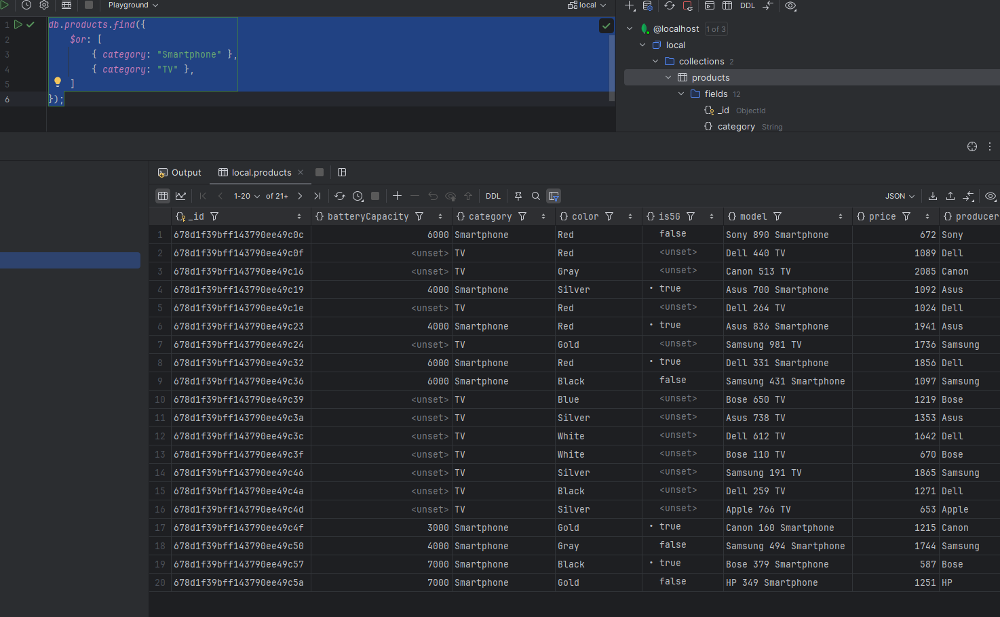
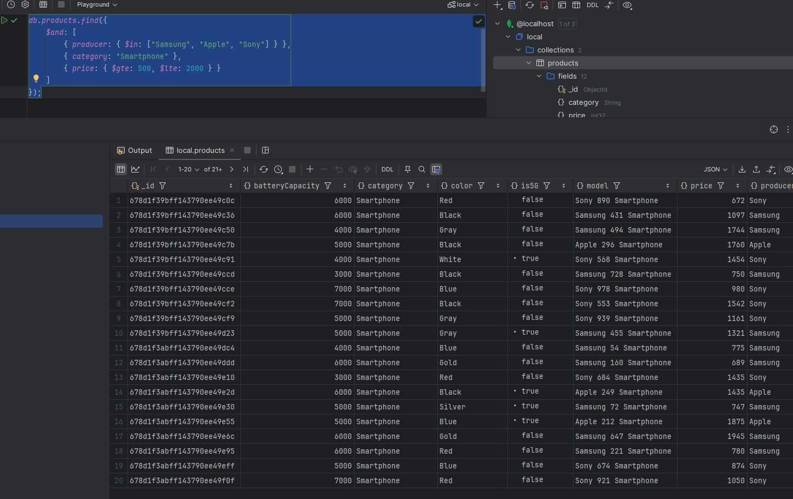
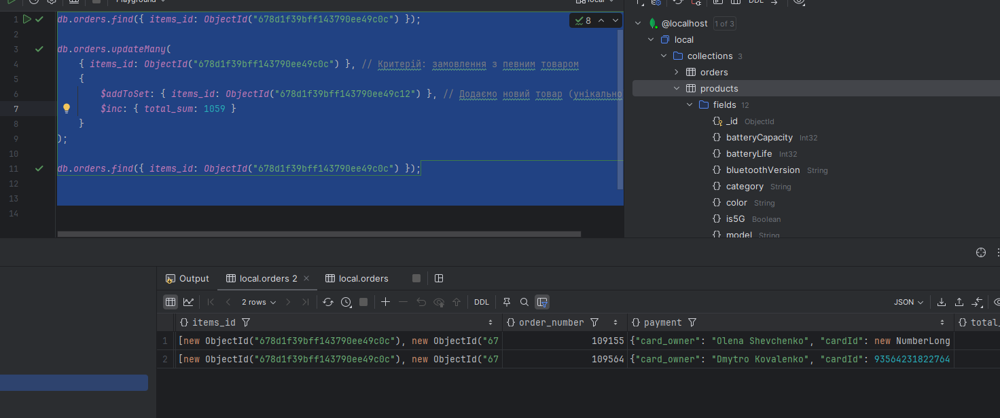
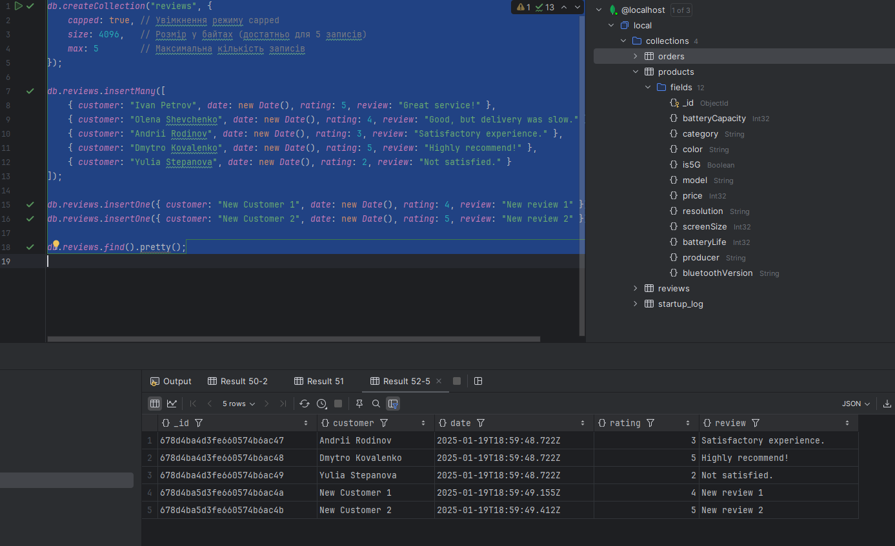

### 1. Створюю список продуктів

```
const categories = ["TV", "Smartphone", "Laptop", "Tablet", "Smartwatch", "Camera", "Headphones", "Speaker", "Printer", "Monitor"];
const producers = ["Samsung", "Apple", "Sony", "LG", "HP", "Dell", "Canon", "Bose", "Xiaomi", "Asus"];
const screenSizes = [24, 32, 40, 50, 55, 60, 65, 75]; // Для TV та моніторів
const colors = ["Black", "White", "Gray", "Silver", "Gold", "Blue", "Red"];
const batteryCapacities = [3000, 4000, 5000, 6000, 7000]; // Для смартфонів, планшетів, годинників
const resolutions = ["1080p", "1440p", "4K", "8K"]; // Для дисплеїв і камер

// Генеруємо 100 продуктів
for (let i = 1; i <= 10000; i++) {
    const category = categories[Math.floor(Math.random() * categories.length)];
    const producer = producers[Math.floor(Math.random() * producers.length)];
    const model = `${producer} ${Math.floor(Math.random() * 1000)} ${category}`;
    const price = Math.floor(Math.random() * 2000) + 100; // Випадкова ціна від 100 до 2100

    // Базовий об'єкт продукту
    const product = {
        category: category,
        model: model,
        producer: producer,
        price: price,
        color: colors[Math.floor(Math.random() * colors.length)],
    };

    // Додаємо специфічні поля для певних категорій
    switch (category) {
        case "TV":
        case "Monitor":
            product.screenSize = screenSizes[Math.floor(Math.random() * screenSizes.length)];
            product.resolution = resolutions[Math.floor(Math.random() * resolutions.length)];
            break;
        case "Smartphone":
        case "Tablet":
        case "Smartwatch":
            product.batteryCapacity = batteryCapacities[Math.floor(Math.random() * batteryCapacities.length)];
            product.is5G = Math.random() > 0.5; // 50% шанс
            break;
        case "Camera":
            product.resolution = resolutions[Math.floor(Math.random() * resolutions.length)];
            product.lensType = Math.random() > 0.5 ? "Wide" : "Telephoto";
            break;
        case "Headphones":
        case "Speaker":
            product.bluetoothVersion = `5.${Math.floor(Math.random() * 3)}`; // Версія Bluetooth 5.0-5.2
            product.batteryLife = Math.floor(Math.random() * 40) + 5; // Випадковий час автономної роботи 5-45 годин
            break;
        case "Printer":
            product.printSpeed = Math.floor(Math.random() * 50) + 10; // Швидкість друку 10-60 сторінок/хв
            product.isColor = Math.random() > 0.5; // Кольоровий або ч/б
            break;
    }

    // Додаємо в колекцію
    db.products.insertOne(product);
}

```

### 2. Напишіть запит, який виводіть усі товари (відображення у JSON)

```
db.products.find()
```


### 3. Підрахуйте скільки товарів у певної категорії

```
db.products.countDocuments({ category: "Smartphone" });
```


### 4. Підрахуйте скільки є різних категорій товарів

```
db.products.distinct("category").length;

```


### 5. Виведіть список всіх виробників товарів без повторів

```
db.products.distinct("producer");
```


### 6. Напишіть запити, які вибирають товари за різними критеріям і їх сукупності: 
#### категорія та ціна (в проміжку) - конструкція $and,

```
db.products.find({
    $and: [
        { category: "Smartphone" },
        { price: { $gte: 500, $lte: 1500 } }
    ]
});
```


#### модель чи одна чи інша - конструкція $or,

```
db.products.find({
    $or: [
        { category: "Smartphone" },
        { category: "TV" },
    ]
});
```



#### $in

```
db.products.find({
    $and: [
        { producer: { $in: ["Samsung", "Apple", "Sony"] } },
        { category: "Smartphone" },
        { price: { $gte: 500, $lte: 2000 } }
    ]
});
```



### 7. Оновить певні товари, змінивши існуючі значення і додайте нові властивості (характеристики) усім товарам за певним критерієм

```
db.products.updateMany(
    {
        $and: [
            { producer: { $in: ["Samsung", "Apple"] } },
            { category: "Laptop" }
        ]
    },
    {
        $set: { isPopular: true }, // Додаємо поле "isPopular"
        $mul: { price: 1.1 }       // Збільшуємо ціну на 10%
    }
);


select * from products where producer in ("Samsung", "Apple") and category = "Laptop";
```


### 8. Знайдіть товари у яких є (присутнє поле) певні властивост

```
db.products.find({
    batteryCapacity: { $exists: true }
});
```


### 9. Для знайдених товарів збільшіть їх вартість на певну суму

Це вже робила в 7 завданні 


------------------------------------

## 2.  Orders
Товари ви додаєте в замовлення - orders, яке містити вартість, ім'я замовника, і адресу доставки.
Товари (items) в замовленні (order) повинні бути представлені у вигляді references, а замовник (customer) у вигляді embed
Приклад моделювання: https://docs.mongodb.com/manual/tutorial/model-referenced-one-to-many-relationships-between-documents/ 

{    
	"order_number" : 201513,
	"date" : ISODate("2015-04-14"),
	"total_sum" : 1923.4,
	"customer" : {
    	"name" : "Andrii",
    	"surname" : "Rodinov",
    	"phones" : [ 9876543, 1234567],
    	"address" : "PTI, Peremohy 37, Kyiv, UA"
	},
	"payment" : {
    	"card_owner" : "Andrii Rodionov",
    	"cardId" : 12345678
	},
	"items_id" : ["552bc0f7bbcdf26a32e99954", "552bc285bbcdf26a32e99957"]
}

### 1. Створіть кілька замовлень з різними наборами товарів, але так щоб один з товарів був у декількох замовленнях

```
// 1. Масив клієнтів
// 1. Масив клієнтів
const customers = [
    { name: "Ivan", surname: "Petrov", phones: [987654321, 123456789], address: "Kyiv, UA" },
    { name: "Olena", surname: "Shevchenko", phones: [234567890], address: "Lviv, UA" },
    { name: "Andrii", surname: "Rodinov", phones: [345678901], address: "Odesa, UA" },
    { name: "Dmytro", surname: "Kovalenko", phones: [987654322], address: "Kharkiv, UA" },
    { name: "Yulia", surname: "Stepanova", phones: [234567891], address: "Dnipro, UA" }
];

// 2. Отримуємо всі товари (перші 10 000 записів)
const products = db.products.find().limit(10000).toArray();

// 3. Функція для генерації випадкового числа в діапазоні
function getRandomInt(min, max) {
    return Math.floor(Math.random() * (max - min + 1)) + min;
}

// 4. Функція для вибору випадкових товарів
function getRandomItems() {
    const itemsCount = getRandomInt(1, 10); // Кількість товарів у замовленні (від 1 до 10)
    const items = [];
    for (let i = 0; i < itemsCount; i++) {
        const randomProduct = products[getRandomInt(0, products.length - 1)];
        if (!items.some(item => item.toString() === randomProduct._id.toString())) {
            items.push(randomProduct);
        }
    }
    return items;
}

// 5. Генерація 11 000 замовлень із використанням клієнтів
for (let i = 1; i <= 11000; i++) {
    const items = getRandomItems();

    // Підрахунок загальної суми замовлення
    const totalSum = items.reduce((sum, item) => {
        return sum + (item ? item.price : 0);
    }, 0);

    // Вибір випадкового клієнта
    const randomCustomer = customers[getRandomInt(0, customers.length - 1)];

    // Вставка замовлення
    db.orders.insertOne({
        order_number: 100000 + i,
        date: new Date(),
        total_sum: totalSum,
        customer: randomCustomer, // Вбудований клієнт
        payment: {
            card_owner: `${randomCustomer.name} ${randomCustomer.surname}`,
            cardId: getRandomInt(1000000000000000, 9999999999999999)
        },
        items_id: items.map(item => item._id) // Вставляємо тільки _id товарів
    });
}

```

Тут створиться 11000 замовльнь, точно якісь товари будуть повторюватися

### 2. Виведіть всі замовлення

db.orders.find().limit(100)

Це не все, але все то занадто багато ) 


### 3. Виведіть замовлення з вартістю більше певного значення

db.orders.find({ total_sum: { $gt: 2000 } }).sort({ total_sum: 1 }).pretty();


### 4. Знайдіть замовлення зроблені одним замовником

```
db.orders.find({
    "customer.name": "Ivan",
    "customer.surname": "Petrov"
})
```


### 5. Знайдіть всі замовлення з певним товаром (товарами) (шукати можна по ObjectId)

```
db.orders.find({
    items_id: ObjectId("678d1f39bff143790ee49c0c")
})
```


### 6. Додайте в усі замовлення з певним товаром ще один товар і збільште існуючу вартість замовлення на деяке значення Х

```
db.orders.find({ items_id: ObjectId("678d1f39bff143790ee49c0c") });

db.orders.updateMany(
    { items_id: ObjectId("678d1f39bff143790ee49c0c") }, // Критерій: замовлення з певним товаром
    {
        $addToSet: { items_id: ObjectId("678d1f39bff143790ee49c12") }, // Додаємо новий товар (унікально)
        $inc: { total_sum: 1059 } 
    }
);

db.orders.find({ items_id: ObjectId("678d1f39bff143790ee49c0c") });

```



### 7. Виведіть кількість товарів в певному замовленні

```
db.orders.aggregate([
    { $match: { _id: ObjectId("678d3d3974a3f767be9a600e") } }, // Знаходимо замовлення за ID
    { $project: { itemsCount: { $size: "$items_id" } } }       // Підраховуємо кількість товарів у масиві items_id
]);
```


### 8. Виведіть тільки інформацію про кастомера і номери кредитної карт, для замовлень вартість яких перевищує певну суму

```
db.orders.find(
    { total_sum: { $gt: 2000 } }, // Умова: замовлення з вартістю більше 2000
    { "customer": 1, "payment.cardId": 1, _id: 0 } // Виводимо тільки інформацію про кастомера і номер картки
).pretty();
```


### 9. Видаліть товар з замовлень, зроблених за певний період дат

```
db.orders.find({
    _id: { $in: [
        ObjectId("678d3d3974a3f767be9a600e"),
        ObjectId("678d3d3974a3f767be9a600f")
    ] },
    date: {
        $gte: ISODate("2025-01-01T00:00:00Z"),
        $lte: ISODate("2025-01-31T23:59:59Z")
    }
}).pretty();

db.orders.updateMany(
    {
        _id: { $in: [
            ObjectId("678d3d3974a3f767be9a600e"),
            ObjectId("678d3d3974a3f767be9a600f")
        ] },
        date: {
            $gte: ISODate("2025-01-01T00:00:00Z"),
            $lte: ISODate("2025-01-31T23:59:59Z")
        }
    },
    {
        $unset: { items_id: "" }
    }
).matchedCount;

db.orders.find({
    _id: { $in: [
        ObjectId("678d3d3974a3f767be9a600e"),
        ObjectId("678d3d3974a3f767be9a600f")
    ] },
    date: {
        $gte: ISODate("2025-01-01T00:00:00Z"),
        $lte: ISODate("2025-01-31T23:59:59Z")
    }
}).pretty();
```

### 10. Перейменуйте у всіх замовлення ім'я (прізвище) замовника

```
db.orders.updateMany(
    {},
    {
        $set: { "customer.name": "NewName", "customer.surname": "NewSurname" }
    }
);
db.orders.find({}).pretty();
```


### 11. Знайдіть замовлення зроблені одним замовником, і виведіть тільки інформацію про кастомера та товари у замовлені підставивши замість ObjectId("***") назви товарів та їх вартість (аналог join-а між таблицями orders та items).

```

db.orders.aggregate([
    {
        $match: {
            "customer.name": "NewName",
            "customer.surname": "NewSurname"
        }
    },
    {
        $lookup: {
            from: "products", // Колекція товарів
            localField: "items_id", // Поле з ObjectId товарів у замовленнях
            foreignField: "_id", // Поле з ObjectId у колекції продуктів
            as: "items" // Назва нового поля для з'єднаних товарів
        }
    },
    {
        $project: {
            _id: 0, // Приховуємо _id замовлення
            customer: 1, // Виводимо інформацію про замовника
            items: { model: 1, price: 1 } // Виводимо назву товарів та їх вартість
        }
    }
]).pretty();
```


### 3 Collection
Створіть Сapped collection яка б містила 5 останніх відгуків на наш інтернет-магазин. Структуру запису визначіть самостійно.
Перевірте що при досягненні обмеження старі відгуки будуть затиратись

```
db.createCollection("reviews", {
    capped: true, // Увімкнення режиму capped
    size: 4096,   // Розмір у байтах (достатньо для 5 записів)
    max: 5        // Максимальна кількість записів
});

db.reviews.insertMany([
    { customer: "Ivan Petrov", date: new Date(), rating: 5, review: "Great service!" },
    { customer: "Olena Shevchenko", date: new Date(), rating: 4, review: "Good, but delivery was slow." },
    { customer: "Andrii Rodinov", date: new Date(), rating: 3, review: "Satisfactory experience." },
    { customer: "Dmytro Kovalenko", date: new Date(), rating: 5, review: "Highly recommend!" },
    { customer: "Yulia Stepanova", date: new Date(), rating: 2, review: "Not satisfied." }
]);

db.reviews.insertOne({ customer: "New Customer 1", date: new Date(), rating: 4, review: "New review 1" });
db.reviews.insertOne({ customer: "New Customer 2", date: new Date(), rating: 5, review: "New review 2" });

db.reviews.find().pretty();

```
