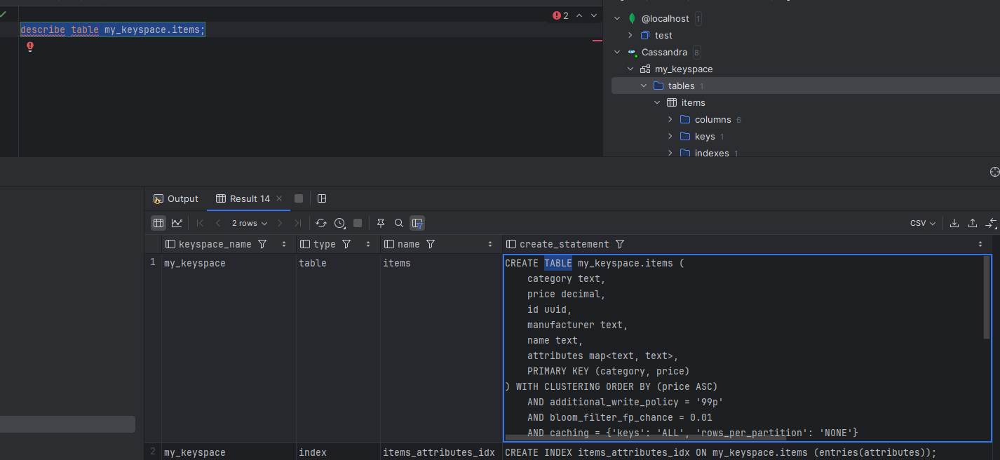
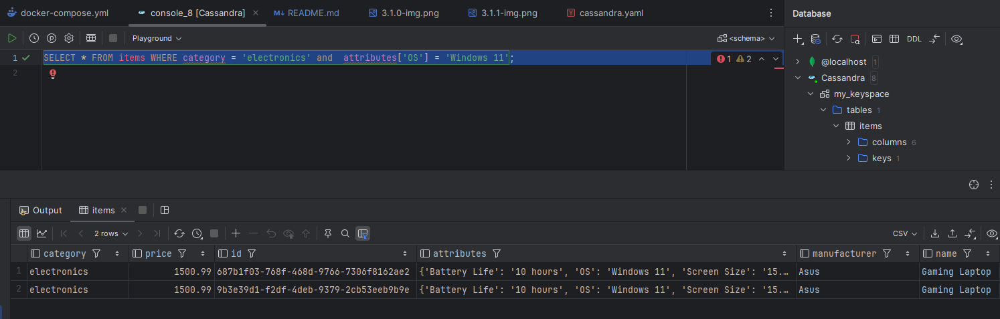

## Створіть keyspace з найпростішої стратегією реплікації https://docs.datastax.com/en/dse/6.8/cql/cql/cql_using/useCreateKeyspace.html

```
create keyspace my_keyspace with replication = {'class': 'SimpleStrategy', 'replication_factor': 1};

```

Аналогічно завданням по MongoDB Вам необхідно змоделювати інтернет-магазин який містить різноманітні товара (тобто у яких різний набір властивостей) - таблиця items. Необхідно, щоб пошук швидко працював для визначеної категорії товарів

Для набору властивостей товару виберіть базові характеристики однакові для всіх товарів (назва, ціна, виробник, ...), а для властивостей які відрізняються використовуйте тип map (з індексом для можливості пошуку по її вмісту)
https://docs.datastax.com/en/dse/6.8/cql/cql/cql_using/useIndexColl.html


```
CREATE TABLE items (
                       category TEXT,
                       id UUID,
                       name TEXT,
                       price DECIMAL,
                       manufacturer TEXT,
                       attributes MAP<TEXT, TEXT>,
                       PRIMARY KEY ((category), price, id)
) WITH CLUSTERING ORDER BY (price ASC);

CREATE INDEX ON items (ENTRIES(attributes));

-- Electronics
INSERT INTO items (category, id, name, price, manufacturer, attributes)
VALUES ('electronics', uuid(), 'Gaming Laptop', 1500.99, 'Asus', {'RAM': '16GB', 'GPU': 'RTX 3060', 'Screen Size': '15.6 inch', 'Battery Life': '10 hours', 'Weight': '2.5 kg', 'OS': 'Windows 11'});
INSERT INTO items (category, id, name, price, manufacturer, attributes)
VALUES ('electronics', uuid(), 'Smartphone', 999.99, 'Samsung', {'Screen Size': '6.5 inch', 'Battery': '5000 mAh', 'Camera': '108 MP', 'OS': 'Android'});
INSERT INTO items (category, id, name, price, manufacturer, attributes)
VALUES ('electronics', uuid(), '4K TV', 1200.00, 'Sony', {'Screen Size': '55 inch', 'Resolution': '4K', 'Smart Features': 'Yes', 'HDR': 'Yes'});
INSERT INTO items (category, id, name, price, manufacturer, attributes)
VALUES ('electronics', uuid(), 'Tablet', 650.00, 'Apple', {'Screen Size': '11 inch', 'Battery Life': '12 hours', 'Storage': '256GB', 'OS': 'iOS'});
INSERT INTO items (category, id, name, price, manufacturer, attributes)
VALUES ('electronics', uuid(), 'Bluetooth Headphones', 199.99, 'Bose', {'Battery Life': '20 hours', 'Noise Cancelling': 'Yes', 'Weight': '300 g'});
INSERT INTO items (category, id, name, price, manufacturer, attributes)
VALUES ('electronics', uuid(), 'Smartwatch', 299.99, 'Garmin', {'Battery Life': '7 days', 'Waterproof': 'Yes', 'Health Tracking': 'Yes', 'GPS': 'Yes'});
INSERT INTO items (category, id, name, price, manufacturer, attributes)
VALUES ('electronics', uuid(), 'Gaming Mouse', 89.99, 'Logitech', {'DPI': '16000', 'Buttons': '8', 'Weight': '85 g'});
INSERT INTO items (category, id, name, price, manufacturer, attributes)
VALUES ('electronics', uuid(), 'Gaming Keyboard', 120.00, 'Corsair', {'Backlight': 'RGB', 'Switch Type': 'Mechanical', 'Macro Keys': 'Yes'});
INSERT INTO items (category, id, name, price, manufacturer, attributes)
VALUES ('electronics', uuid(), 'External SSD', 250.00, 'Samsung', {'Capacity': '1TB', 'Interface': 'USB 3.2', 'Weight': '100 g'});
INSERT INTO items (category, id, name, price, manufacturer, attributes)
VALUES ('electronics', uuid(), 'Wireless Charger', 50.00, 'Anker', {'Output Power': '15W', 'Compatibility': 'Qi-enabled devices', 'Weight': '200 g'});

-- Footwear
INSERT INTO items (category, id, name, price, manufacturer, attributes)
VALUES ('footwear', uuid(), 'Running Shoes', 120.50, 'Nike', {'Size': '42', 'Color': 'Black', 'Material': 'Mesh', 'Weight': '300 g', 'Waterproof': 'Yes', 'Purpose': 'Running'});
INSERT INTO items (category, id, name, price, manufacturer, attributes)
VALUES ('footwear', uuid(), 'Casual Shoes', 89.99, 'Adidas', {'Size': '41', 'Color': 'White', 'Material': 'Leather', 'Purpose': 'Casual'});
INSERT INTO items (category, id, name, price, manufacturer, attributes)
VALUES ('footwear', uuid(), 'Hiking Boots', 150.00, 'Salomon', {'Size': '43', 'Color': 'Brown', 'Material': 'Gore-Tex', 'Purpose': 'Hiking', 'Waterproof': 'Yes'});
INSERT INTO items (category, id, name, price, manufacturer, attributes)
VALUES ('footwear', uuid(), 'Sandals', 35.00, 'Birkenstock', {'Size': '42', 'Color': 'Beige', 'Material': 'Cork', 'Purpose': 'Casual'});
INSERT INTO items (category, id, name, price, manufacturer, attributes)
VALUES ('footwear', uuid(), 'Formal Shoes', 200.00, 'Clarks', {'Size': '40', 'Color': 'Black', 'Material': 'Leather', 'Purpose': 'Formal'});
INSERT INTO items (category, id, name, price, manufacturer, attributes)
VALUES ('footwear', uuid(), 'Slippers', 25.00, 'Puma', {'Size': '39', 'Color': 'Blue', 'Material': 'Foam', 'Purpose': 'Indoor'});
INSERT INTO items (category, id, name, price, manufacturer, attributes)
VALUES ('footwear', uuid(), 'Soccer Cleats', 180.00, 'Nike', {'Size': '44', 'Color': 'Red', 'Material': 'Synthetic', 'Purpose': 'Sports'});
INSERT INTO items (category, id, name, price, manufacturer, attributes)
VALUES ('footwear', uuid(), 'Winter Boots', 130.00, 'Columbia', {'Size': '42', 'Color': 'Gray', 'Material': 'Thermal', 'Purpose': 'Winter', 'Waterproof': 'Yes'});
INSERT INTO items (category, id, name, price, manufacturer, attributes)
VALUES ('footwear', uuid(), 'Flip Flops', 15.00, 'Havaianas', {'Size': '40', 'Color': 'Green', 'Material': 'Rubber'});
INSERT INTO items (category, id, name, price, manufacturer, attributes)
VALUES ('footwear', uuid(), 'Trail Running Shoes', 140.00, 'Altra', {'Size': '43', 'Color': 'Orange', 'Material': 'Mesh', 'Purpose': 'Trail Running'});

-- Furniture
INSERT INTO items (category, id, name, price, manufacturer, attributes)
VALUES ('furniture', uuid(), 'Office Chair', 250.75, 'IKEA', {'Color': 'Gray', 'Material': 'Fabric', 'Weight Capacity': '120 kg', 'Adjustable Height': 'Yes', 'Armrests': 'Yes', 'Warranty': '5 years'});
INSERT INTO items (category, id, name, price, manufacturer, attributes)
VALUES ('furniture', uuid(), 'Dining Table', 500.00, 'IKEA', {'Color': 'Brown', 'Material': 'Wood', 'Seats': '6', 'Warranty': '10 years'});
INSERT INTO items (category, id, name, price, manufacturer, attributes)
VALUES ('furniture', uuid(), 'Sofa', 850.00, 'Ashley', {'Color': 'Blue', 'Material': 'Velvet', 'Seats': '3', 'Warranty': '3 years'});
INSERT INTO items (category, id, name, price, manufacturer, attributes)
VALUES ('furniture', uuid(), 'Bookshelf', 120.00, 'Sauder', {'Color': 'White', 'Material': 'Wood', 'Shelves': '5'});
INSERT INTO items (category, id, name, price, manufacturer, attributes)
VALUES ('furniture', uuid(), 'Coffee Table', 150.00, 'West Elm', {'Color': 'Black', 'Material': 'Glass', 'Shape': 'Round'});
INSERT INTO items (category, id, name, price, manufacturer, attributes)
VALUES ('furniture', uuid(), 'Wardrobe', 750.00, 'Wayfair', {'Color': 'Walnut', 'Material': 'Wood', 'Doors': '3', 'Mirror': 'Yes'});
INSERT INTO items (category, id, name, price, manufacturer, attributes)
VALUES ('furniture', uuid(), 'Bed Frame', 450.00, 'Zinus', {'Color': 'Gray', 'Material': 'Metal', 'Size': 'Queen'});
INSERT INTO items (category, id, name, price, manufacturer, attributes)
VALUES ('furniture', uuid(), 'Recliner', 600.00, 'La-Z-Boy', {'Color': 'Beige', 'Material': 'Leather', 'Adjustable': 'Yes', 'Warranty': '10 years'});
INSERT INTO items (category, id, name, price, manufacturer, attributes)
VALUES ('furniture', uuid(), 'Nightstand', 80.00, 'Target', {'Color': 'White', 'Material': 'Wood', 'Drawers': '2'});
INSERT INTO items (category, id, name, price, manufacturer, attributes)
VALUES ('furniture', uuid(), 'TV Stand', 200.00, 'Best Buy', {'Color': 'Black', 'Material': 'Metal', 'Weight Capacity': '50 kg'});

```

### 1. Напишіть запит, який показує структуру створеної таблиці (команда DESCRIBE)

```
describe table my_keyspace.items;
```


### 2. Напишіть запит, який виводить усі товари в певній категорії відсортовані за ціною

```
SELECT * FROM items WHERE category = 'electronics';
```


### 3. Напишіть запити, які вибирають товари за різними критеріями в межах певної категорії (тут де треба замість індексу використайте Matirialized view):

#### - 3.1 назва

Create view
```
CREATE MATERIALIZED VIEW items_by_name AS
SELECT category, name, price, id, manufacturer, attributes
FROM my_keyspace.items
WHERE category IS NOT NULL AND name IS NOT NULL AND price IS NOT NULL AND id IS NOT NULL
PRIMARY KEY (category, name, price, id);
```


Select statement
SELECT * FROM items_by_name WHERE category = 'electronics' AND name = 'Gaming Laptop';


#### - 3.2 ціна (в проміжку),

```
SELECT * FROM items WHERE category = 'electronics' AND price > 10 and price < 150;

```


#### - 3.3 ціна та виробник 

```
CREATE MATERIALIZED VIEW items_by_manufacturer_and_price AS
SELECT category, name, price, id, manufacturer, attributes
FROM my_keyspace.items
WHERE category IS NOT NULL AND manufacturer IS NOT NULL AND price IS NOT NULL AND id IS NOT NULL
PRIMARY KEY (category, manufacturer, price, id);

select * from items_by_manufacturer_and_price
         where category = 'electronics'
           and manufacturer = 'Logitech'
           and price > 10 and price < 200

```


### 4 Напишіть запити, які вибирають товари за:
#### 4.1 наявність певних характеристик

SELECT * FROM items
WHERE category = 'electronics' AND attributes CONTAINS KEY 'GPU';

!! Але це чомусь не працює ніяк, не дозволяє все рівно фільтрувати саме так, проте по значення йому окей)
Напишите як то потім реалізувати, щоб то було. Хоча виглядає, що це просто не треба в касандрі))

#### 4.2 певна характеристика та її значення

```
SELECT * FROM items WHERE category = 'electronics' and  attributes['OS'] = 'Windows 11';
```


### 5. Оновити опис товару:
#### 5.1 змінить існуючі значення певної характеристики 

Тут я зрозуміла, що мені не треба буо відразу додавати прайс до кей, а це треба було в якомусь матерілайзед в'ю робити

ТОму я пересвторила базову баличку на 

```
CREATE TABLE items (
                       category TEXT,
                       id UUID,
                       name TEXT,
                       price DECIMAL,
                       manufacturer TEXT,
                       attributes MAP<TEXT, TEXT>,
                       PRIMARY KEY ((category), id)
);

CREATE INDEX ON items (ENTRIES(attributes));

-- Electronics
INSERT INTO items (category, id, name, price, manufacturer, attributes)
VALUES ('electronics', uuid(), 'Gaming Laptop', 1500.99, 'Asus', {'RAM': '16GB', 'GPU': 'RTX 3060', 'Screen Size': '15.6 inch', 'Battery Life': '10 hours', 'Weight': '2.5 kg', 'OS': 'Windows 11'});
INSERT INTO items (category, id, name, price, manufacturer, attributes)
VALUES ('electronics', uuid(), 'Smartphone', 999.99, 'Samsung', {'Screen Size': '6.5 inch', 'Battery': '5000 mAh', 'Camera': '108 MP', 'OS': 'Android'});
INSERT INTO items (category, id, name, price, manufacturer, attributes)
VALUES ('electronics', uuid(), '4K TV', 1200.00, 'Sony', {'Screen Size': '55 inch', 'Resolution': '4K', 'Smart Features': 'Yes', 'HDR': 'Yes'});
INSERT INTO items (category, id, name, price, manufacturer, attributes)
VALUES ('electronics', uuid(), 'Tablet', 650.00, 'Apple', {'Screen Size': '11 inch', 'Battery Life': '12 hours', 'Storage': '256GB', 'OS': 'iOS'});
INSERT INTO items (category, id, name, price, manufacturer, attributes)
VALUES ('electronics', uuid(), 'Bluetooth Headphones', 199.99, 'Bose', {'Battery Life': '20 hours', 'Noise Cancelling': 'Yes', 'Weight': '300 g'});
INSERT INTO items (category, id, name, price, manufacturer, attributes)
VALUES ('electronics', uuid(), 'Smartwatch', 299.99, 'Garmin', {'Battery Life': '7 days', 'Waterproof': 'Yes', 'Health Tracking': 'Yes', 'GPS': 'Yes'});
INSERT INTO items (category, id, name, price, manufacturer, attributes)
VALUES ('electronics', uuid(), 'Gaming Mouse', 89.99, 'Logitech', {'DPI': '16000', 'Buttons': '8', 'Weight': '85 g'});
INSERT INTO items (category, id, name, price, manufacturer, attributes)
VALUES ('electronics', uuid(), 'Gaming Keyboard', 120.00, 'Corsair', {'Backlight': 'RGB', 'Switch Type': 'Mechanical', 'Macro Keys': 'Yes'});
INSERT INTO items (category, id, name, price, manufacturer, attributes)
VALUES ('electronics', 36842444-8f55-4e38-9c00-e2c7c566c805, 'External SSD', 250.00, 'Samsung', {'Capacity': '1TB', 'Interface': 'USB 3.2', 'Weight': '100 g'});
INSERT INTO items (category, id, name, price, manufacturer, attributes)
VALUES ('electronics', uuid(), 'Wireless Charger', 50.00, 'Anker', {'Output Power': '15W', 'Compatibility': 'Qi-enabled devices', 'Weight': '200 g'});

-- Footwear
INSERT INTO items (category, id, name, price, manufacturer, attributes)
VALUES ('footwear', uuid(), 'Running Shoes', 120.50, 'Nike', {'Size': '42', 'Color': 'Black', 'Material': 'Mesh', 'Weight': '300 g', 'Waterproof': 'Yes', 'Purpose': 'Running'});
INSERT INTO items (category, id, name, price, manufacturer, attributes)
VALUES ('footwear', uuid(), 'Casual Shoes', 89.99, 'Adidas', {'Size': '41', 'Color': 'White', 'Material': 'Leather', 'Purpose': 'Casual'});
INSERT INTO items (category, id, name, price, manufacturer, attributes)
VALUES ('footwear', uuid(), 'Hiking Boots', 150.00, 'Salomon', {'Size': '43', 'Color': 'Brown', 'Material': 'Gore-Tex', 'Purpose': 'Hiking', 'Waterproof': 'Yes'});
INSERT INTO items (category, id, name, price, manufacturer, attributes)
VALUES ('footwear', uuid(), 'Sandals', 35.00, 'Birkenstock', {'Size': '42', 'Color': 'Beige', 'Material': 'Cork', 'Purpose': 'Casual'});
INSERT INTO items (category, id, name, price, manufacturer, attributes)
VALUES ('footwear', uuid(), 'Formal Shoes', 200.00, 'Clarks', {'Size': '40', 'Color': 'Black', 'Material': 'Leather', 'Purpose': 'Formal'});
INSERT INTO items (category, id, name, price, manufacturer, attributes)
VALUES ('footwear', uuid(), 'Slippers', 25.00, 'Puma', {'Size': '39', 'Color': 'Blue', 'Material': 'Foam', 'Purpose': 'Indoor'});
INSERT INTO items (category, id, name, price, manufacturer, attributes)
VALUES ('footwear', uuid(), 'Soccer Cleats', 180.00, 'Nike', {'Size': '44', 'Color': 'Red', 'Material': 'Synthetic', 'Purpose': 'Sports'});
INSERT INTO items (category, id, name, price, manufacturer, attributes)
VALUES ('footwear', uuid(), 'Winter Boots', 130.00, 'Columbia', {'Size': '42', 'Color': 'Gray', 'Material': 'Thermal', 'Purpose': 'Winter', 'Waterproof': 'Yes'});
INSERT INTO items (category, id, name, price, manufacturer, attributes)
VALUES ('footwear', uuid(), 'Flip Flops', 15.00, 'Havaianas', {'Size': '40', 'Color': 'Green', 'Material': 'Rubber'});
INSERT INTO items (category, id, name, price, manufacturer, attributes)
VALUES ('footwear', uuid(), 'Trail Running Shoes', 140.00, 'Altra', {'Size': '43', 'Color': 'Orange', 'Material': 'Mesh', 'Purpose': 'Trail Running'});

-- Furniture
INSERT INTO items (category, id, name, price, manufacturer, attributes)
VALUES ('furniture', uuid(), 'Office Chair', 250.75, 'IKEA', {'Color': 'Gray', 'Material': 'Fabric', 'Weight Capacity': '120 kg', 'Adjustable Height': 'Yes', 'Armrests': 'Yes', 'Warranty': '5 years'});
INSERT INTO items (category, id, name, price, manufacturer, attributes)
VALUES ('furniture', uuid(), 'Dining Table', 500.00, 'IKEA', {'Color': 'Brown', 'Material': 'Wood', 'Seats': '6', 'Warranty': '10 years'});
INSERT INTO items (category, id, name, price, manufacturer, attributes)
VALUES ('furniture', uuid(), 'Sofa', 850.00, 'Ashley', {'Color': 'Blue', 'Material': 'Velvet', 'Seats': '3', 'Warranty': '3 years'});
INSERT INTO items (category, id, name, price, manufacturer, attributes)
VALUES ('furniture', uuid(), 'Bookshelf', 120.00, 'Sauder', {'Color': 'White', 'Material': 'Wood', 'Shelves': '5'});
INSERT INTO items (category, id, name, price, manufacturer, attributes)
VALUES ('furniture', uuid(), 'Coffee Table', 150.00, 'West Elm', {'Color': 'Black', 'Material': 'Glass', 'Shape': 'Round'});
INSERT INTO items (category, id, name, price, manufacturer, attributes)
VALUES ('furniture', uuid(), 'Wardrobe', 750.00, 'Wayfair', {'Color': 'Walnut', 'Material': 'Wood', 'Doors': '3', 'Mirror': 'Yes'});
INSERT INTO items (category, id, name, price, manufacturer, attributes)
VALUES ('furniture', uuid(), 'Bed Frame', 450.00, 'Zinus', {'Color': 'Gray', 'Material': 'Metal', 'Size': 'Queen'});
INSERT INTO items (category, id, name, price, manufacturer, attributes)
VALUES ('furniture', uuid(), 'Recliner', 600.00, 'La-Z-Boy', {'Color': 'Beige', 'Material': 'Leather', 'Adjustable': 'Yes', 'Warranty': '10 years'});
INSERT INTO items (category, id, name, price, manufacturer, attributes)
VALUES ('furniture', uuid(), 'Nightstand', 80.00, 'Target', {'Color': 'White', 'Material': 'Wood', 'Drawers': '2'});
INSERT INTO items (category, id, name, price, manufacturer, attributes)
VALUES ('furniture', uuid(), 'TV Stand', 200.00, 'Best Buy', {'Color': 'Black', 'Material': 'Metal', 'Weight Capacity': '50 kg'});

select * from items  where category = 'electronics' and  id = 36842444-8f55-4e38-9c00-e2c7c566c805;

UPDATE items
SET attributes['Capacity'] = '2TB'
WHERE category = 'electronics' AND id =  36842444-8f55-4e38-9c00-e2c7c566c805;

select * from items  where category = 'electronics' and  id = 36842444-8f55-4e38-9c00-e2c7c566c805;

```

не стала вже прероблювати минулі задачі, тому шо зрозуміла ідею


#### 5.2 додайте нові властивості (характеристики) товару

```
UPDATE items
SET attributes['new_prop'] = 'new'
WHERE category = 'electronics' AND id =  36842444-8f55-4e38-9c00-e2c7c566c805;

select * from items  where category = 'electronics' and  id = 36842444-8f55-4e38-9c00-e2c7c566c805;
```


#### 5.3 видалить характеристику товару

```
DELETE attributes['Capacity']
FROM items
WHERE category = 'electronics' AND id = 36842444-8f55-4e38-9c00-e2c7c566c805;

select * from items  where category = 'electronics' and  id = 36842444-8f55-4e38-9c00-e2c7c566c805;
```


# Orders
Створіть таблицю orders в якій міститься ім'я замовника і інформація про замовлення: перелік id-товарів у замовленні, вартість замовлення, дата замовлення, .... Для кожного замовника повинна бути можливість швидко шукати його замовлення і виконувати по них запити.

```
CREATE TABLE orders (
                        customer_name TEXT,
                        order_id UUID,
                        item_ids LIST<UUID>,
                        total_price DECIMAL,
                        order_date TIMESTAMP,
                        PRIMARY KEY (customer_name, order_id)
) WITH CLUSTERING ORDER BY (order_id DESC);

INSERT INTO orders (customer_name, order_id, item_ids, total_price, order_date)
VALUES ('John Doe', uuid(), [36842444-8f55-4e38-9c00-e2c7c566c805, 85844562-30df-48da-bba4-207278639486], 500, '2025-01-20T10:00:00.000Z');

INSERT INTO orders (customer_name, order_id, item_ids, total_price, order_date)
VALUES ('John Doe', uuid(), [6f2fac65-cb69-44e3-9661-8ea408d4d157], 300, '2025-01-19T15:30:00.000Z');

INSERT INTO orders (customer_name, order_id, item_ids, total_price, order_date)
VALUES ('Jane Smith', uuid(), [2d350b2f-b1ad-4c71-bee1-6fba6f9934ad, 2d350b2f-b1ad-4c71-bee1-6fba6f9934ad], 700, '2025-01-18T14:45:00.000Z');

INSERT INTO orders (customer_name, order_id, item_ids, total_price, order_date)
VALUES ('Jane Smith', uuid(), [a68c3ad8-278b-45ba-be8b-48ff68ead116], 150, '2025-01-17T18:20:00.000Z');

```

ТУТ важлива помітка, що я розумію, що в реальному продукту класторінг кей треба зробити айді кастомера, а не нейм.
Але для простішого розуміння тестових даних тут роблю ось так, щоб простіше просто орієнтуватися мені особисто  ) 

### 1. Напишіть запит, який показує структуру створеної таблиці (команда DESCRIBE)

describe table my_keyspace.orders;


### 2. Для замовника виведіть всі його замовлення відсортовані за часом коли вони були зроблені

```
CREATE MATERIALIZED VIEW orders_by_order_date AS
SELECT *
FROM my_keyspace.orders
WHERE customer_name IS NOT NULL AND order_date IS NOT NULL AND order_id IS NOT NULL
PRIMARY KEY (customer_name, order_date, order_id);

select * from orders_by_order_date where customer_name = 'John Doe';
```
Хоча в реальнмоу проеті я б так не робила,  я б ліпше перебдачила шо ордейр айді він завжди буде збільшуватися типу юід в7.
І тоді не треба буде сортувати по даті, а буде достатньо по тому як створювалися запити в табличці по айді


### 3. Для замовника знайдіть замовлення з певним товаром

```
CREATE INDEX ON orders (item_ids);

SELECT * FROM orders
WHERE customer_name = 'John Doe' AND item_ids CONTAINS 6f2fac65-cb69-44e3-9661-8ea408d4d157;
```

це додати в ключ не можна, оскільки тип не підходе, тому індекс


